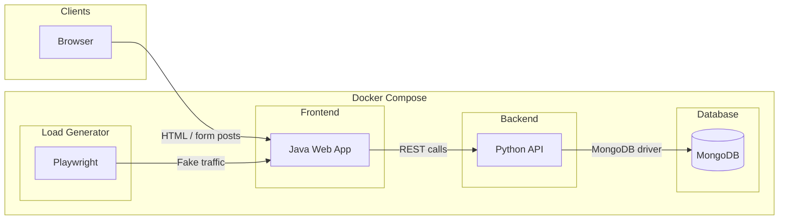

# Classic Jazz E-commerce Webapp – Development Plan

## Scope

- **App name:** Classic Jazz (fictitious store for classic jazz records).
- **Style:** Simple, non-professional; inspired by [The Sound of Vinyl – Jazz](https://thesoundofvinyl.us/collections/jazz) (product grid, add-to-cart, checkout).
- **Architecture:** Microservices (frontend, backend, database); no Datadog/OpenTelemetry instrumentation in this phase.
- **Workspace:** Empty repo; everything will be created from scratch.

---

## High-Level Architecture



- **Frontend (Java):** Serves 3 HTML pages and submits forms / triggers requests to the Python API (cart, checkout, sign-in, sign-up).
- **Backend (Python):** REST API for customers, cart, orders; single point of access to MongoDB.
- **MongoDB:** One container; two collections (customers, purchases). No direct browser–DB access.
- **Load generator (optional):** Playwright (Node.js) container that hits the frontend every minute for 40 seconds to generate fake user traffic for Datadog practice.

---

## 1. Frontend (Java) – 3 Pages Only

**Technology choice:** Spring Boot + Thymeleaf (or JSP). Simple server-rendered pages, minimal JS. Easy to add RUM/APM later.

**Suggested structure:**

- `frontend/` (Maven project)
  - `pom.xml` – Spring Boot Web, Thymeleaf, optional RestTemplate/WebClient for calling backend.
  - `src/main/java/.../ClassicJazzApplication.java`
  - Controllers: one controller (or three minimal controllers) for the 3 routes below.
  - `src/main/resources/templates/` – 3 Thymeleaf templates.
  - `src/main/resources/static/` – optional CSS (single stylesheet) and placeholder images if needed.

**Pages:**

| Page | Route | Content |

|------|--------|---------|

| **Home / Catalog** | `/` or `/catalog` | 6 albums in a simple grid; each with title, artist, price, SKU, “Add to cart” (form or link that POSTs to backend or to cart page). |

| **Sign in / Sign up** | `/signin` or `/auth` | Two forms: (1) Sign in: email + password (or just email for simplicity). (2) Sign up: first name, last name, email (and optional password). Forms POST to Python backend; frontend redirects on success/failure. |

| **Cart / Checkout** | `/cart` or `/checkout` | List cart items (from session or backend); form to “complete order” and optionally register (first name, last name, email) if not signed in. Submits to Python backend. |

**Static product data (for the 6 albums):**

- John Coltrane – *Giant Steps* – SKU e.g. `CJ-GS-001`, price e.g. `29.99`
- Miles Davis – *Amandla* – e.g. `CJ-MA-002`, `24.99`
- Joe Henderson – *In and Out* – e.g. `CJ-IО-003`, `27.99`
- Wayne Shorter – *Night Dreamer* – e.g. `CJ-ND-004`, `26.99`
- Hermeto Paschoal – *Live at Montreux* – e.g. `CJ-LM-005`, `22.99`
- Ray Brown – *Walk On* – e.g. `CJ-WO-006`, `25.99`

Frontend can keep this list in memory or in a config file; catalog can later be loaded from backend if you add a “products” API.

**Flow:**

- “Add to cart” sends product id/SKU and quantity to Python (e.g. `POST /cart` or `POST /orders/add-item`). Backend can return minimal JSON; frontend either redirects to `/cart` or shows a simple “Added” message.
- Sign-in/Sign-up POST to Python (`/auth/signin`, `/auth/signup`); backend returns success/failure (and optionally a session id or token); frontend sets cookie or session and redirects.
- Checkout POST to Python (`/checkout` or `/orders`) with cart contents + customer (or customer id if signed in); backend writes to MongoDB and returns order id.

No need for a full JS framework; optional minimal JS for “Add to cart” without full page reload.

---

## 2. Backend (Python) – REST API

**Technology choice:** FastAPI (or Flask). FastAPI gives OpenAPI docs and is easy to instrument later with OpenTelemetry/Datadog.

**Suggested structure:**

- `backend/` (Python project)
  - `requirements.txt`: `fastapi`, `uvicorn`, `pymongo`, `python-dotenv` (and later `ddtrace` etc.).
  - `main.py` or `app.py` – FastAPI app, CORS for frontend origin, router includes.
  - Routers/handlers for:
    - **Auth:** `POST /auth/signup` (first name, last name, email, optional password), `POST /auth/signin` (email, optional password). On signup/signin, create or find customer in DB and return a simple session identifier or “customer_id” (or use a cookie set by backend).
    - **Cart/Orders:** `POST /cart` or `POST /orders/items` (add item by SKU + quantity), `GET /cart` (optional), `POST /checkout` or `POST /orders` (cart + customer info or customer_id). Persist orders in MongoDB “purchases” collection.
  - **MongoDB:** Single client (e.g. `pymongo.MongoClient(os.getenv("MONGODB_URI", "mongodb://mongodb:27017"))`). Two collections: `customers`, `purchases`.

**Data shapes (conceptual):**

- **customers:** `{ _id, first_name, last_name, email, created_at }` (and optionally `password_hash` if you add auth).
- **purchases:** `{ _id, customer_id (or email), items: [ { sku, title, quantity, price } ], total, created_at }`.

No authentication required for the “simple” version: sign-in can just validate email and return a customer id; no JWT or passwords if you want to keep it minimal. You can add passwords later for practice.

---

## 3. Database (MongoDB)

- **Single MongoDB instance** in Docker (e.g. `mongo:7` or `mongo:6`).
- **Two collections:**
  - **customers** – customer info (first name, last name, email, optional password hash).
  - **purchases** – purchase records (customer reference, line items with SKU/quantity/price, total, timestamp).
- No init scripts required for “simple”; collections created on first insert. Optional: a small script or Compose init container to insert the 6 products into a `products` collection if you later move catalog to the backend.

---

## 4. Docker Compose – “All in One” Setup

Use **one Docker Compose file** that wires the three services (frontend, backend, MongoDB). Each service runs in **its own container** (microservices); “one Docker Container” is interpreted here as “one Compose file / one stack,” not a single container for all three.

**Suggested layout:**

- Repo root:
  - `docker-compose.yml` – defines services: `frontend`, `backend`, `mongodb`.
  - `frontend/` – Java app + `Dockerfile` (e.g. Eclipse Temurin 21 + Maven build; run `java -jar ...`).
  - `backend/` – Python app + `Dockerfile` (e.g. `python:3.12-slim`, `pip install -r requirements.txt`, `uvicorn`).
  - `README.md` – how to run `docker compose up`, URLs for frontend (e.g. `http://localhost:8080`) and backend (e.g. `http://localhost:8000`).

**Compose snippet (conceptual):**

- **mongodb:** image `mongo:7`, port `27017:27017`, optional volume for data persistence.
- **backend:** build `./backend`, ports `8000:8000`, env `MONGODB_URI=mongodb://mongodb:27017`, `depends_on: mongodb`.
- **frontend:** build `./frontend`, ports `8080:8080`, env `BACKEND_URL=http://backend:8000`, `depends_on: backend`.
- **loadgen:** build from repo root with `dockerfile: load-gen/Dockerfile`, env `BASE_URL=http://frontend:8080`, `depends_on: frontend`, `ipc: host`, `init: true`. Waits for frontend to be ready, then runs Playwright script for 40s every minute.

Frontend calls backend using service name `http://backend:8000` from inside Docker; from the browser, CORS must allow the frontend origin (e.g. `http://localhost:8080`).

---

## 5. Implementation Order

1. **MongoDB + Backend**

   - Create `backend/` with FastAPI, PyMongo, and routes for signup, signin, add-to-cart, checkout.
   - Define minimal Pydantic models for request/response.
   - Test with `curl` or Postman (no frontend yet).

2. **Frontend**

   - Create `frontend/` with Spring Boot + Thymeleaf; implement the 3 pages and static catalog (6 albums).
   - Point frontend to `http://backend:8000` (in Compose) and `http://localhost:8000` for local dev if needed.
   - Wire forms and “Add to cart” to backend API.

3. **Docker**

   - Add `Dockerfile` in `backend/` and `frontend/`.
   - Add root `docker-compose.yml`; run full stack and verify: open catalog, add to cart, sign up, checkout, then check MongoDB for `customers` and `purchases`.

4. **Optional**

   - Single CSS file for a “Classic Jazz” look (e.g. dark theme, simple typography).
   - Placeholder images for albums (or external URLs) to make the catalog page clearer.

---

## 6. Where Datadog / OpenTelemetry Will Fit Later

- **Frontend (Java):** Datadog RUM (browser SDK) on the 3 pages; optional APM/tracing for Spring Boot (dd-trace-java or OpenTelemetry Java agent).
- **Backend (Python):** Datadog APM (ddtrace) or OpenTelemetry Python SDK; logs via std out or Datadog log forwarder.
- **MongoDB:** Optional Datadog integration or span from Python driver.
- **Docker Compose:** Add Datadog Agent container and env vars (e.g. `DD_API_KEY`, `DD_SITE`) when you are ready; no need in this first phase.

---

## 7. User Context Tracking (`user_context.json`)

A **user context file** is maintained by the frontend for Datadog RUM session tracking. It stores all users who have signed up or signed in as a JSON array, ready to be consumed by the RUM SDK.

**How it works:**

- **Model:** `UserContext` record (`id`, `name`, `email`) in `frontend/src/main/java/com/classicjazz/model/UserContext.java`.
- **Service:** `UserContextService` in `frontend/src/main/java/com/classicjazz/service/UserContextService.java`:
  - On startup (`@PostConstruct`): creates an empty `[]` JSON array if the file doesn't exist.
  - `writeUserContext(id, name, email)`: reads the existing array, skips duplicates (by `id`), appends the new user, and writes back. Method is `synchronized` to avoid concurrent-write corruption.
  - Null entries (all three fields null) are ignored.
- **Wiring:**
  - **Signup** (`AuthController`): appends user (customer_id, first + last name, email) on successful signup.
  - **Signin** (`AuthController`): fetches customer details from backend, appends user on successful signin.
  - **Signout:** clears session attributes but does **not** remove users from the file (append-only).
  - **Checkout** (`CartController`): does **not** write to the file (only signup/signin do).
- **Configuration:** `classicjazz.user-context.file` in `application.properties` (defaults to `user_context.json`). In Docker Compose, set via env `CLASSICJAZZ_USER_CONTEXT_FILE=/app/data/user_context.json` and mounted to a Docker volume (`frontend_user_context_data`).
- **Load generator integration:** Each 40s load-gen run creates one fake user via `POST /auth/signup` at the start of the run; this triggers the frontend to append the fake user to the file. The file accumulates both load-gen fake users and manually created (real UI) users.
- **File format (example):**
```json
[
  {
    "id": "69ab8072...",
    "name": "Sarah Coltrane",
    "email": "loadgen-sarah-coltrane-...@example.com"
  },
  {
    "id": "69ab80bc...",
    "name": "Romário Brito",
    "email": "romariobrito@brasil.com"
  }
]
```

- **`.gitignore`:** `user_context.json` is listed so generated user data is not committed.

---

## 8. Load Generator (Fake Traffic for Datadog)

A **loadgen** service was added to simulate users so you can see traffic in Datadog once the app is instrumented (RUM, APM, Logs).

**Technology:** Node.js + **Playwright** (headless Chromium). Real browser sessions generate realistic HTTP and frontend activity.

**Location:** `load-gen/`

- **`package.json`** – dependency `playwright` (version pinned to match Docker image, e.g. `1.58.2`).
- **`run.js`** – script that runs for 40 seconds. First, creates one fake user via direct HTTP POST to `/auth/signup` (with browser fallback), which triggers the frontend to append the user to `user_context.json`. Then launches one or more guest “user” sessions: open catalog, add 1–2 random albums to cart, fill checkout and submit when the form is present (skips when cart is empty). Uses 20 first names and 20 last names for variety. Handles SIGTERM gracefully and logs `Load gen finished: N session(s) + 1 fake user signup in 40.0s`.
- **`Dockerfile`** – base image `mcr.microsoft.com/playwright:v1.58.2-noble`. Before the main loop, the container waits for the frontend to respond; then every minute: run `node run.js` for 40s, sleep 20s.

**Docker Compose:** **loadgen** service in `docker-compose.yml` with `BASE_URL=http://frontend:8080`, `depends_on: frontend`, `ipc: host`, `init: true`.

**Usage:** Included in `docker compose up --build`. Local one-off: `cd load-gen && npm install && BASE_URL=http://localhost:8080 timeout 40 node run.js`. See README “Load generator (fake traffic for Datadog)”.

---

## Summary

| Component | Tech | Deliverable |

|-----------|------|-------------|

| Frontend | Java (Spring Boot + Thymeleaf) | 3 pages: catalog (6 albums), sign-in/sign-up, cart/checkout; calls Python API |

| Backend | Python (FastAPI) | REST API for auth and orders; reads/writes MongoDB |

| Database | MongoDB | 2 collections: `customers`, `purchases` |

| Load generator | Node.js + Playwright | Fake traffic: catalog, add-to-cart, checkout every minute for 40s; creates 1 fake user per run for Datadog RUM/APM/Logs practice |

| User context | Java (UserContextService) | `user_context.json` – append-only JSON array of all signed-up/signed-in users (for Datadog RUM SDK) |

| Orchestration | Docker Compose | One `docker-compose.yml`; 4 containers (frontend, backend, mongodb, loadgen) + volumes for MongoDB data and user context |

This gives you a minimal, runnable Classic Jazz store so you can later add Datadog RUM, Logs, APM, and OpenTelemetry without changing the app structure.