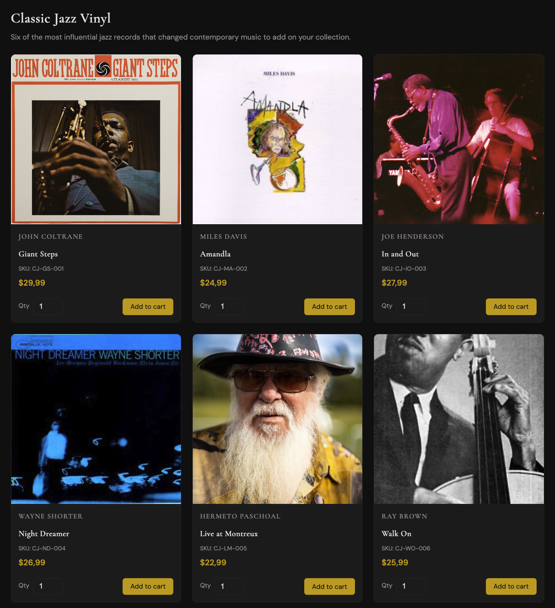
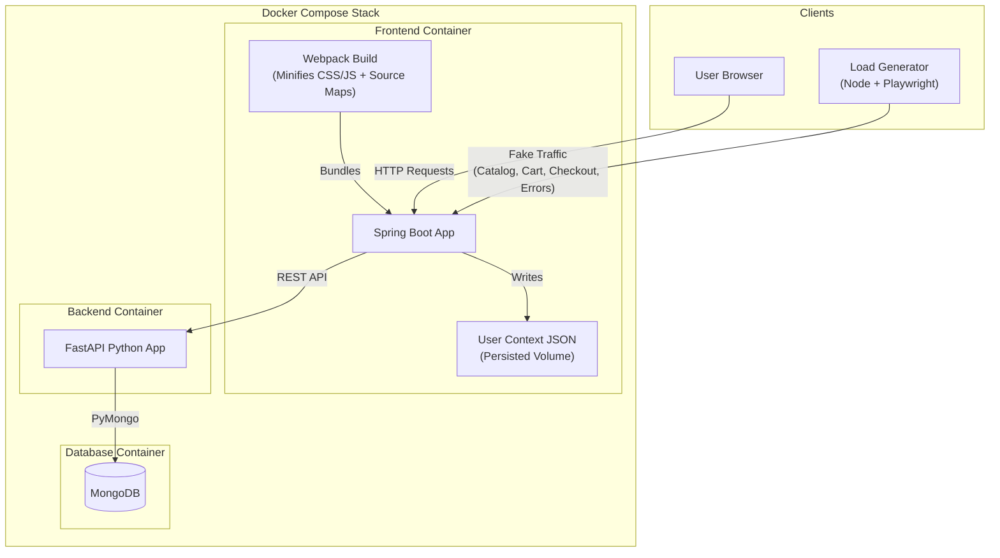

# Classic Jazz – E-commerce (Datadog practice app)
The ***'Classic Jazz Store'*** is a simple 3 page e-commerce web application for practicing **End-to-End Correlation** and **Instrumentation** in Datadog.

## Features

- MongoDB Database with two Collections: 
  - User Registration
  - Purchased Items by SKUs

- Python Fast API Backend

- Java SpringBoot FrontEnd with:
  - Dynamic User Context Created - for future RUM `UserContext` custom instrumentation
  - Minified Code and Sourcemaps done with Webpack
  - A load generator that runs on a cron schedule for 40s every minute. This load generator registers fake users into the `UserContext`, generates random fake traffic and tons of fake errors for practicing `Error Tracking` and `Event Management` and other products in Datadog.

## How to start the App
Assuming that you have Docker, Java and Python in your machine, run:

```
docker compose up --build
```

Go into your your Browser, register and purchase some vynils of the Jazz Legends!

```
http://localhost:8080/
```




## App Architecture


---
## Challenges/Exercises

***Can you configure/install/implement...?***

### Infra
- Install the Datadog Agent
- Add custom infra tags


### Logs
- Enable Log Collection
- Configure Multi Line detection
- Configure Multiline and Truncated auto tagging in the Agent

### APM
- Manually Instrument the Python Fast API
- Add custom APM tags in the APM deployement
- Create Custom Span Tags in the code
- Enable the Continuos Profiler
- Correlate APM<>Logs

### DBM
- Configure DBM for the MongoDB Database
- Enable APM<>DBM Propagation
- Add custom tags to each MDB Collection in the `mongo.d/conf.yaml` file
- Make sure that the MongoDB Logs are correlated

### RUM

- Instrument the RUM Java Browser SDK
- Configure the `UserContext`
- Configure `GlobalContext` for the `Checkout` page
- Use the `beforeSend` to add some business logic that can be beneficial in the future inside the Datadog Platform

- Upload the already created Webpack Sourcemaps - *you can find them in the `frontend` container:*

```
docker compose exec frontend sh -c "unzip -l app.jar | grep .map"
```
- Correlate RUM <> APM
- Correlate RUM <> Logs

### Product Analytics
- Configure Product Analytics in the Datadog Platform based on what's instruemented in RUM
- Add additional APP Data to enrich the product knowledge through a `CSV` file in Product Analytics

### All Security Products
- Implement All Security Products

### Cloud Deployment
- Install the Secrets Manager Binary in the Agent
- Create a Secret in the Cloud, add the API, APP Keys + the MongoDB 'datadog' user and password for the DBM instrumentation
- Deploy this is APP in the Cloud: AWS Fargate or GCP Cloud Run or the Azure Equivalent. It should be able to use the secrets configured in Secrets Management
- Put this into a CICD Pipeline, in which any time someone changes the Java Frontend Code, the pipeline will have two dedicated steps: 
  1) Create new sourcemaps with Webpack
  2) Upload these new sourcemaps to Datadog

### OpenTelemetry

- Instrument the backend with OpenTelemetry instead of the Datadog Python Tracer and use the DDOT

*OR, even better ...*

- Instrument the backend with OpenTelemetry instead of the Datadog Python Tracer and use a custom ***Collector*** to ship telemetry to Datadog

- Enable Propagation from the Otel Tracer

---
## How this App works - *additional information about the stack*

This app can be broken in two phases:

**Phase 1** is the **FastAPI backend** and **MongoDB**.  
**Phase 2** adds the **Java (Spring Boot + Thymeleaf) frontend**, a Playwright load generator, and additional tooling for Datadog practice (Webpack minification/source maps, user context tracking, fake errors).

Fake users would look something like this in the `user_context.json` file (inside the container):

```
{
  "id" : "69adb7a492704432b57edb9a",
  "name" : "John Coltrane",
  "email" : "synthetic-user-john-coltrane-1772992420091@example.com"
}, {
  "id" : "69adb7e092704432b57edb9b",
  "name" : "Carmen Coltrane",
  "email" : "synthetic-user-carmen-coltrane-1772992480245@example.com"
},
```

---

## Full stack (Phase 1 + 2) with Docker Compose

From the repo root:

```bash
docker compose up --build
```

- **Frontend:** http://localhost:8080  
- **API:** http://localhost:8000  
- **API Docs:** http://localhost:8000/docs  
- **MongoDB:** localhost:27017 (database `classic_jazz`)

---


## Phase 1 only: Backend + MongoDB

Phase 1 is the **FastAPI backend** and **MongoDB** with two collections: `customers` and `purchases`. No frontend yet.

## Quick start with Docker Compose

From the repo root:

```bash
docker compose -f docker-compose.backend.yml up --build
```

- **API:** http://localhost:8000  
- **Docs:** http://localhost:8000/docs  
- **MongoDB:** localhost:27017 (database `classic_jazz`)

## Run backend locally (MongoDB in Docker)

1. Start only MongoDB:

   ```bash
   docker compose -f docker-compose.backend.yml up mongodb -d
   ```

2. In the repo root, create a venv and run the API:

   ```bash
   cd <PATH_TO_PROJECT_DIR>/datadog-end-to-end-correlation-lab
   python -m venv .venv
   source .venv/bin/activate   # or .venv\Scripts\activate on Windows
   pip install -r backend/requirements.txt
   export MONGODB_URI=mongodb://localhost:27017
   uvicorn backend.main:app --reload
   ```

   Or with a `.env` file in `backend/` (copy from `backend/.env.example`):

   ```bash
   MONGODB_URI=mongodb://localhost:27017 uvicorn backend.main:app --reload
   ```

   Then open http://localhost:8000/docs .

## API endpoints

| Method | Path | Description |
|--------|------|-------------|
| GET | `/health` | Liveness check |
| POST | `/auth/signup` | Register (first_name, last_name, email) → customer_id |
| POST | `/auth/signin` | Sign in by email → customer_id |
| POST | `/orders/checkout` | Create purchase (items + customer) → order_id |

## Test with curl

**Health:**

```bash
curl -s http://localhost:8000/health
```

**Sign up:**

```bash
curl -s -X POST http://localhost:8000/auth/signup \
  -H "Content-Type: application/json" \
  -d '{"first_name":"John","last_name":"Coltrane","email":"john@example.com"}'
```

**Sign in:**

```bash
curl -s -X POST http://localhost:8000/auth/signin \
  -H "Content-Type: application/json" \
  -d '{"email":"john@example.com"}'
```

**Checkout (guest):**

```bash
curl -s -X POST http://localhost:8000/orders/checkout \
  -H "Content-Type: application/json" \
  -d '{
    "items": [
      {"sku": "CJ-GS-001", "title": "Giant Steps", "quantity": 1, "price": 29.99}
    ],
    "customer": {
      "first_name": "Miles",
      "last_name": "Davis",
      "email": "miles@example.com"
    }
  }'
```

**Checkout (signed-in, with customer_id from signin):**

```bash
curl -s -X POST http://localhost:8000/orders/checkout \
  -H "Content-Type: application/json" \
  -d '{
    "items": [
      {"sku": "CJ-MA-002", "title": "Amandla", "quantity": 2, "price": 24.99}
    ],
    "customer": {
      "first_name": "John",
      "last_name": "Coltrane",
      "email": "john@example.com"
    },
    "customer_id": "<paste customer_id from signup/signin>"
  }'
```

## MongoDB collections

- **customers:** `first_name`, `last_name`, `email`, `created_at`
- **purchases:** `customer_id` (optional), `email`, `items` (array of sku, title, quantity, price), `total`, `created_at`

You can inspect data with MongoDB Shell or Compass:

```bash
docker exec -it classic-jazz-mongodb mongosh classic_jazz --eval "db.customers.find().pretty(); db.purchases.find().pretty();"
```

---

## Phase 2: Frontend (Java)

The frontend is a Spring Boot 3 + Thymeleaf app with:

- **Catalog** (`/`) — 6 jazz albums (John Coltrane *Giant Steps*, Miles Davis *Amandla*, Joe Henderson *In and Out*, Wayne Shorter *Night Dreamer*, Hermeto Paschoal *Live at Montreux*, Ray Brown *Walk On*) with prices, SKUs, and album art. Add to cart posts to session and redirects to cart.
- **Sign in / Sign up** (`/auth`) — Sign in by email; sign up with first name, last name, email. Both call the backend API; on success, `customer_id` is stored in session.
- **Cart & Checkout** (`/cart`) — List cart items, total, and a checkout form (first name, last name, email). Place order POSTs to backend `/orders/checkout` and clears the cart.

**CSS/JS:** Source assets are in `frontend/src/main/resources/static-src/`. A **Webpack** build step (in Docker) extracts inline JS, minifies CSS/JS, and generates **source maps** (`.map`) into `static/dist/`.

**Fake Frontend Errors:** The frontend has a `DebugController` with endpoints to generate errors for Datadog practice:
- `/debug/error` (500)
- `/debug/slow` (5-10s delay)
- `/debug/not-found` (404)

**User Context Tracking:**
The frontend maintains a `user_context.json` file (persisted in a Docker volume) that tracks all signed-up/signed-in users. This simulates a user database extract for Datadog RUM session tracking.
View it with: `docker compose exec frontend cat /app/data/user_context.json`

**Run frontend locally** (with backend + MongoDB already running; requires Java 21, Maven, Node.js):

```bash
cd datadog-end-to-end-correlation-lab/frontend
mvn spring-boot:run
```

Or run the **full stack** with Docker (no local Maven needed):

```bash
docker compose up --build
```

Then open http://localhost:8080 (backend URL defaults to http://localhost:8000).

---

## Load generator (fake traffic for Datadog)

The **loadgen** service uses **Playwright** (headless Chromium) to simulate realistic user traffic. It runs **every minute for 40 seconds** (then sleeps 20s).

**What it does per cycle:**
1. **Creates a fake user:** Signs up a new synthetic user (e.g. `synthetic-user-miles-davis-123@example.com`) via HTTP POST so `user_context.json` is updated.
2. **Runs guest sessions:** Browses catalog, adds items to cart, and checks out (as guest).
3. **Generates errors:** Runs an "error session" that triggers JS exceptions, console errors, 404s, 500s, and broken resources (for Datadog Error Tracking practice).

Included when you run the full stack:

```bash
docker compose up --build
```

The loadgen container (`classic-jazz-loadgen`) hits the frontend at `http://frontend:8080`. To run it standalone (e.g. against a local frontend), set `BASE_URL`:

```bash
cd load-gen
npm install
BASE_URL=http://localhost:8080 node run.js
```

To run the script once for 40 seconds locally:

```bash
timeout 40 node run.js
```
